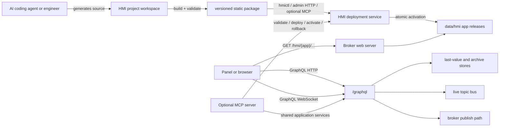

# Edge HMI Runtime and AI Authoring Plan

## Status

Proposed design. No implementation has started.

This plan intentionally changes an earlier product decision: the edge broker would
be allowed to host user-facing HMI applications. If implementation is approved,
the repository guide and the stale Dashboard section in `README.md` must be updated
so the new scope is explicit.

## Executive decision

Build the HMI as a **static web-application runtime on the broker's existing HTTP
origin**, with a small, versioned JavaScript SDK that uses the broker's existing
GraphQL API for all process data:

- GraphQL queries for current values and topic discovery.
- GraphQL WebSocket subscriptions for live values.
- GraphQL queries for raw and aggregated history.
- GraphQL mutations for operator commands/publishes.

Use MCP only as an **optional AI authoring and deployment adapter**. HMI screens
must not require MCP at runtime. An HMI should continue to run if no AI service,
MCP client, cloud connection, or build tool is available.

The first implementation should host built HTML/CSS/JavaScript applications and
provide a constrained SDK, component kit, package manifest, validator, and atomic
deployment mechanism. It should not try to become a complete browser-based HMI
editor in the first release.

The longer-term model is hybrid:

1. Every HMI is a static application and can use normal HTML/CSS/JavaScript.
2. Standard controls and data bindings use a declarative JSON format that AI can
   generate reliably.
3. Custom JavaScript remains possible for screens that exceed the declarative
   component set.

## Goals

- Host multiple independently versioned HMI applications on one edge broker.
- Let one application contain multiple screens and navigation entries.
- Run locally on a WinCC Unified Comfort Panel and in normal desktop/tablet
  browsers.
- Keep the process-data contract on the existing GraphQL API.
- Support current values, live updates, writes, raw history, and aggregated trends.
- Make AI generation reproducible by giving agents a stable manifest, SDK,
  component catalogue, validation rules, examples, and deployment API.
- Preserve the small, pure-Go, no-CGO broker and avoid installing Node.js or a
  compiler on the panel.
- Deploy releases atomically and permit rollback without reconstructing files.
- Apply the same user and topic ACLs to GraphQL as MQTT.

## Non-goals for the first release

- Running generated server-side code inside the broker.
- Running an LLM or a JavaScript build toolchain on the panel.
- Replacing WinCC Unified Runtime or integrating with its internal tag APIs.
- A full drag-and-drop engineering environment.
- Arbitrary shell or filesystem access through MCP.
- Loading libraries, fonts, or assets from public CDNs at runtime.
- Using MCP as the screen-to-broker data protocol.

## Current broker baseline

The broker already contains most of the required data plane.

| Capability | Current implementation | HMI consequence |
|---|---|---|
| Current value | `currentValue` and `currentValues` | Reuse through the SDK. Values come from an archive group's last-value store. |
| Live value | `topicUpdates` and `topicUpdatesBulk` over `graphql-transport-ws` | Reuse. Prefer bulk/coalesced subscriptions for busy screens. |
| Raw history | `archivedMessages` | Reuse after payload, ordering, filtering, ACL, and limit tests are complete. |
| Aggregated history | Field exists in the parity schema | Resolver currently returns an empty table and must be implemented before trend widgets rely on it. |
| Topic discovery | `searchTopics` and `browseTopics` | Reuse for engineering and diagnostics. |
| Operator writes | `publish` and `publishBatch` | Reuse only after GraphQL authentication and publish ACL enforcement are implemented. |
| Static hosting | None | Add an HMI application manager and HTTP handlers. |
| Authentication | `login` returns an opaque token | The token is not currently validated by HTTP or WebSocket requests. This is a release blocker. |
| GraphQL ACL | None on value/history/subscription queries; GraphQL publish uses the inline broker client | Add explicit read/write checks; the inline publish path bypasses MQTT ACL checks. |
| Browser security | CORS is `*`; WebSocket origin checks always return true | Replace with configured same-origin/allow-list behavior. |
| History default | The automatically provisioned `Default` group has an in-memory last-value store and `ArchiveType: NONE` | Current values work by default, but history does not. Production HMI setup must explicitly enable an archive. |
| Slow subscribers | In-process subscription buffers drop when full to protect the MQTT hot path | The SDK must coalesce, expose connection/staleness state, and periodically reconcile current values. |

There is also a documentation mismatch: `README.md` describes a `Dashboard`
configuration that is absent from `internal/config/config.go` and the JSON schema.
The HMI implementation should replace that stale section rather than revive an
incompatible configuration by accident.

## WinCC Unified Comfort Panel constraints

The initial runtime must target the lowest common denominator of the panel's
embedded Web Control, not only a current desktop browser.

Siemens documents the Unified Panel WebKit browser as supporting XMLHttpRequest,
WebSocket, CORS, iframe sandboxing, Canvas 2D, and `requestAnimationFrame`, but not
Web Components, Service Workers, local storage, IndexedDB, Web Crypto, or Promises.
The Web Control is implemented as an iframe. Siemens also recommends avoiding
heavy 3D custom controls on Comfort Panels.

Therefore the compatibility build must:

- Produce a self-contained ES5-compatible IIFE/UMD bundle.
- Use XMLHttpRequest for queries or include an owned `fetch` polyfill.
- Include an owned Promise polyfill if the SDK exposes Promises internally.
- Avoid Custom Elements, Shadow DOM, Service Workers, IndexedDB, WebGL, and a
  dependency on local storage.
- Use SVG and/or Canvas 2D for gauges and trends.
- Bundle all code, CSS, fonts, icons, and polyfills with the application.
- Work inside an iframe and never depend on top-level navigation or popups.
- Provide large touch targets, explicit focus styling, and fixed-panel as well as
  responsive layouts.

References:

- [Siemens WebKit browser capabilities](https://docs.tia.siemens.cloud/r/en-us/v20/operating-unified-panel-rt-unified/operation-in-unified-runtime-rt-unified/web-browser-of-webkit-engine-rt-unified?contentId=pxA2vefHfZYzrRtsyqlKQw)
- [Siemens Web Control behavior](https://docs.tia.siemens.cloud/r/en-us/v21/configuring-screens-rt-unified/overview-of-screen-objects-rt-unified/controls-rt-unified/web-control-rt-unified?contentId=ZjTUym3F2GixmgQ9U0yuJg)
- [Siemens Custom Web Control performance guidance](https://support.industry.siemens.com/cs/attachments/109794040/CuCoWCCUenUS_en-US.pdf)

The standalone Browser app may be more capable, but it must be treated as an
additional target. A real-panel spike must record the firmware version, user-agent,
TLS behavior, iframe behavior, WebSocket behavior, and available JavaScript APIs.

## Target architecture



### One web origin

Mount static HMI routes on the same `chi` server and port as GraphQL:

```text
/graphql                         GraphQL HTTP and WebSocket
/health                          health check
/hmi/                            application catalogue/launcher
/hmi/{appId}/                    active application release
/hmi-runtime/v1/                 broker-owned SDK and component runtime
/api/hmi/v1/...                  disabled-by-default admin deployment API
```

Same-origin hosting removes the routine need for permissive CORS and makes
`/graphql` and the WebSocket URL relative. It also makes an app portable between
`localhost`, a panel IP, DNS names, and a reverse proxy.

Refactor `internal/graphql/server.go` into a small composite web server rather
than starting another HTTP listener. Keep the existing `GraphQL.Port` setting in
the first compatibility release; changing the public configuration hierarchy is
not necessary to deliver the HMI.

### Static execution boundary

The broker serves bytes only. Application JavaScript executes in the browser,
not in the Go process. Uploaded packages may contain only approved static file
types. They cannot add Go handlers, execute shell commands, load plugins, or read
the broker filesystem.

This boundary is important for availability: a broken screen may consume its
browser tab, but it must not execute on or block the MQTT publish path.

## HMI application package

Each release is a zip archive or directory containing built assets and a required
manifest:

```text
my-machine-hmi/
  hmi.app.json
  index.html
  assets/
    app.js
    app.css
    ...
```

Proposed `hmi.app.json` shape:

```json
{
  "schemaVersion": 1,
  "id": "machine-1",
  "name": "Machine 1",
  "version": "1.3.0",
  "entry": "index.html",
  "sdkVersion": "1",
  "screens": [
    { "id": "overview", "title": "Overview", "path": "/" },
    { "id": "trends", "title": "Trends", "path": "/trends" }
  ],
  "display": {
    "width": 1366,
    "height": 768,
    "orientation": "landscape",
    "theme": "dark"
  },
  "permissions": {
    "subscribe": ["machine/1/#"],
    "publish": ["machine/1/command/#"],
    "archiveGroups": ["Default"]
  }
}
```

Create a draft-07 JSON Schema for this manifest. Validate at build time and again
inside the broker before installation.

The `permissions` block is both documentation and a least-privilege request. It
is not a security boundary by itself because browser JavaScript can forge normal
requests. Server enforcement requires an authenticated user plus a broker-issued,
short-lived app session whose allowed topics are the intersection of:

```text
user ACL AND application manifest permissions
```

Never embed a service-account password or permanent bearer token in a static
application. Use interactive login for normal deployments. A later kiosk mode
may mint a short-lived scoped session from broker-side provisioning, but its
credential must not be shipped in JavaScript.

### Release storage and activation

Use an application data directory, not `embed.FS`, because applications change
independently of the broker binary:

```text
data/hmi/
  apps/
    machine-1/
      releases/
        1.2.0/
        1.3.0/
      active.json
```

Deployment sequence:

1. Stream the upload into a bounded temporary file.
2. Validate package size, file count, names, extensions, manifest, hashes, and
   uncompressed size.
3. Reject absolute paths, `..`, symlinks, hard links, device files, duplicate
   normalized paths, and zip bombs.
4. Extract into a staging directory under the HMI data root.
5. Validate `index.html`, all declared screen paths, and local asset references.
6. Rename staging to the immutable release directory.
7. Atomically replace `active.json` only after the release is complete.
8. Keep at least the previous active release for immediate rollback.

Do not edit an active release in place. The admin API should deploy, activate,
rollback, list, inspect, and eventually delete old inactive releases as distinct
operations.

### HTTP behavior

- Serve correct MIME types and `X-Content-Type-Options: nosniff`.
- Serve hashed assets with long immutable cache headers.
- Serve `index.html`, `hmi.app.json`, and `active.json` with no-cache/revalidate.
- Implement SPA fallback only inside the selected application and never for
  `/graphql`, `/api`, `/health`, or another app.
- Support precompressed gzip assets; do not require Brotli on the panel.
- Add a configurable `frame-ancestors` policy compatible with embedding from the
  WinCC Unified Runtime origin. Do not emit an unconditional `X-Frame-Options:
  SAMEORIGIN`, which would block the Web Control iframe.
- Default CSP to local resources and local GraphQL connections. Allow external
  origins only through explicit configuration.

## Browser SDK

Publish a versioned, framework-neutral SDK at `/hmi-runtime/v1/` and as a package
for authoring projects. The broker-hosted copy and the development package must be
built from the same sources.

Suggested public surface:

```javascript
var client = MonsterHMI.createClient({
  graphqlUrl: "/graphql",
  archiveGroup: "Default"
});

client.getValue(topic, options, callback);
client.getValues(topicFilter, options, callback);
client.watch(topicFilters, options, onUpdate, onState);
client.getHistory(topicFilter, range, options, callback);
client.getAggregatedHistory(topics, range, interval, fields, functions, callback);
client.publish(topic, payload, options, callback);
client.publishBatch(messages, callback);
client.login(username, password, callback);
client.logout();
```

The compatibility bundle should offer callbacks even if the modern development
wrapper also offers Promises.

### SDK responsibilities

- Use relative same-origin HTTP and derive `ws:`/`wss:` correctly.
- Implement `graphql-transport-ws`, including `connection_init`, reconnect with
  jittered backoff, re-subscription, keep-alive handling, and clean unsubscribe.
- Put the authenticated token into HTTP requests and WebSocket initialization.
- Decode the GraphQL `JSON` and base64 `BINARY` payload conventions consistently.
- Normalize raw history into chronological order for charts while preserving the
  original timestamp.
- Validate topic filters, QoS, and publish payload shape before sending.
- Expose connection state, last update, staleness, and error/quality information.
- Use `topicUpdatesBulk` for groups of widgets and coalesce repeated updates by
  topic before rendering.
- Throttle DOM/chart updates to animation frames.
- Reconcile active bindings with `currentValues` after reconnect and periodically
  on long-running screens to heal dropped live updates.
- Bound history rows and query ranges. Use aggregation for large trend windows.
- Cancel queries and subscriptions when a screen is hidden or destroyed.

### Race-free initial binding

A naïve `currentValue` followed by `topicUpdates` can miss a publish between the
query and subscription. `watch` should:

1. Establish the subscription and begin buffering updates.
2. Query the current snapshot.
3. Merge the snapshot and buffered updates by timestamp.
4. Emit the newest value for every bound topic.

This gives widgets a stable initial value without opening one WebSocket per widget.

## HMI component and binding framework

Start with a small component kit implemented with normal DOM functions and CSS
classes, not Web Components. It should remain usable from plain JavaScript and
from a bundled React/Vue/Svelte application if a project chooses one.

First component set:

- Value/text display with unit, formatting, quality, and stale state.
- Status lamp and multi-state indicator.
- Numeric input, text input, button, momentary button, switch, and slider.
- Bar, gauge, progress, and simple SVG process symbol.
- Raw payload inspector for diagnostics.
- Trend chart using Canvas 2D or SVG.
- Navigation/menu, modal confirmation, and notification area.
- Connection/offline banner.

Operator controls need industrial behavior, not only visual styling:

- Optional confirmation before writes.
- Disabled/interlock state.
- Requested value versus confirmed process feedback.
- Command timeout and failure indication.
- Momentary press/release semantics where required.
- Value range, scaling, precision, and engineering unit.
- Staleness and data-quality state visible independently of the numeric value.

Define bindings in a schema that AI can generate and validate:

```json
{
  "id": "temperature",
  "topic": "machine/1/temperature",
  "archiveGroup": "Default",
  "format": "JSON",
  "field": "value",
  "unit": "°C",
  "staleAfterMs": 5000,
  "history": { "interval": "FIVE_MINUTES", "functions": ["AVG", "MIN", "MAX"] }
}
```

The initial app template may use TypeScript and a build step on the engineering
machine, but the deployed output must be framework-free static files and include
all compatibility transformations. Avoid requiring every generated screen to
understand raw GraphQL messages.

## History and trend implementation

History is a first-class HMI requirement, not an optional widget feature.

### Broker work required

1. Extend `stores.MessageArchive` with an aggregation method compatible with the
   existing Java broker contract.
2. Port the existing SQLite, PostgreSQL, and MongoDB aggregation behavior from the
   sibling Java repository rather than inventing a different result shape.
3. Wire `aggregatedMessages` to the archive implementation and retain the existing
   GraphQL field, arguments, enum values, columns, and rows.
4. Correct raw-history payload reading for archive rows stored in `payload_json` as
   well as `payload_blob` without changing the shared table layout.
5. Test exact topics and MQTT wildcard filters. SQL `LIKE` conversion must not let
   `+` cross topic levels or treat literal `%`/`_` as unintended wildcards.
6. Validate time ranges and enforce server-side maximum limits to protect SQLite
   and panel memory.
7. Apply subscribe ACL checks to every topic requested by raw or aggregated
   history.
8. Preserve database indexes on `(topic, time)` and `time`; benchmark common
   one-hour, one-day, and one-week trend requests on panel-class storage.

### Runtime behavior

- Short windows may query raw samples and downsample in the browser only when the
  bounded result is small.
- Long windows must use `aggregatedMessages`.
- Trend widgets choose a bucket size based on pixel width and time range, with an
  explicit override.
- Re-query history after reconnect rather than trying to reconstruct a trend from
  potentially dropped live events.
- Tell operators when an archive group is disabled or does not cover a topic;
  never display an empty chart as if it meant a valid zero-valued signal.

The deployment guide must include creation of a persistent archive group. The
automatic `Default` group currently has no archive and therefore cannot supply
history until reconfigured.

## Authentication and security prerequisite

Static hosting is straightforward; safe control operation is the harder part.
Before write-capable screens are accepted, implement a single authorization model
for GraphQL HTTP, GraphQL WebSocket, HMI deployment, and optional MCP.

### Session handling

- Replace predictable `session-<username>-<timestamp>` tokens with
  cryptographically random, expiring server-side sessions or signed tokens.
- Validate `Authorization: Bearer` on GraphQL HTTP requests.
- Validate the token supplied in WebSocket `connection_init` and bind the user to
  the subscription context.
- Make `currentUser` reflect the authenticated context.
- Invalidate sessions when a user is disabled/deleted or a password is changed.
- Define expiry, logout, and restart behavior explicitly.

### Topic authorization

- `currentValue`, `currentValues`, topic discovery, retained values, raw history,
  aggregated history, and `topicUpdates*` require subscribe permission.
- `publish` and `publishBatch` require publish permission for every concrete topic.
- Admin/configuration GraphQL fields retain their existing admin requirements.
- Wildcard requests must be checked safely. Where a user's ACL is narrower than a
  requested filter, either reject it or filter every returned/delivered concrete
  topic using the same cache as MQTT.
- Do not rely on the embedded/inline MQTT client for GraphQL authorization; it is
  designed to bypass broker ACL checks.

### Web hardening

- Replace wildcard CORS with same-origin by default and an explicit allowed-origin
  list for engineering clients.
- Replace unconditional WebSocket origin acceptance with the same allow-list.
- Add TLS to the composite web listener or document a supported TLS reverse-proxy
  deployment. Validate the certificate flow on the Comfort Panel.
- Require authenticated admin privileges for deploy, activate, rollback, and
  delete operations.
- Record an audit event for HMI release changes and write operations, without
  logging passwords or bearer tokens.
- Add request body, GraphQL complexity/depth, subscription count, history row,
  upload, and per-user rate limits.

## AI authoring workflow

AI should work on a normal source repository, not edit files directly in an active
release on the broker.

Recommended workflow:

1. Agent discovers broker capabilities, topics, sample payloads, archive groups,
   SDK version, component catalogue, and panel profile.
2. Agent scaffolds an HMI project from a broker-owned template.
3. Agent creates or edits manifest, bindings, HTML, CSS, and JavaScript/TypeScript.
4. Local build produces a self-contained compatibility bundle.
5. Validator checks manifest, permissions, missing assets, external URLs, browser
   compatibility rules, CSP compatibility, accessibility basics, and package
   budgets.
6. Automated browser tests exercise generated screens with recorded topic data.
7. Human reviews a screenshot/preview and the requested subscribe/publish topics.
8. CLI or MCP deploys an immutable release.
9. Human explicitly activates it; health check failure permits immediate rollback.

Provide the agent with versioned, machine-readable resources:

- HMI manifest JSON Schema.
- Binding/component schemas and examples.
- GraphQL SDL and example operations.
- Topic/payload samples, with secrets redacted.
- Archive group capabilities.
- Panel compatibility profile and performance budgets.
- A starter application containing overview, controls, and trend examples.
- A validation report format with file, rule, severity, and suggested fix.

The template and component catalogue should do more for reliable AI generation
than a broad prompt saying "build an HMI". Generated code should have a narrow,
testable contract.

## CLI and deployment API

Implement one HMI application service and expose it through a small admin HTTP API
and a development CLI. MCP should later wrap the same service rather than owning a
second implementation.

Candidate API:

```text
GET    /api/hmi/v1/apps
GET    /api/hmi/v1/apps/{appId}
POST   /api/hmi/v1/apps/{appId}/releases
POST   /api/hmi/v1/apps/{appId}/releases/{version}/activate
POST   /api/hmi/v1/apps/{appId}/rollback
GET    /api/hmi/v1/apps/{appId}/releases/{version}/validation
DELETE /api/hmi/v1/apps/{appId}/releases/{version}
```

Candidate CLI:

```text
hmictl init
hmictl validate ./dist
hmictl package ./dist
hmictl deploy ./machine-1-1.3.0.zip --broker https://panel:4000
hmictl activate machine-1 1.3.0 --broker https://panel:4000
hmictl rollback machine-1 --broker https://panel:4000
```

Keep HMI administration out of the edge-only GraphQL schema initially. The
repository requires the edge GraphQL schema to remain a strict subset of the Java
broker. HMI GraphQL administration fields can be added later only if the matching
schema is introduced in the Java broker in lockstep.

## Optional MCP interface

MCP is useful for discovery, validation, and controlled deployment, but it should
be a later adapter after the SDK, validator, and deployment service are stable.
This is also a separate feature-scope decision because MCP was intentionally
excluded from the original edge subset.

Suggested read-only MCP resources:

```text
hmi://runtime/sdk/v1/reference
hmi://runtime/components/v1/catalog
hmi://runtime/manifest/v1/schema
hmi://graphql/schema
hmi://apps
hmi://apps/{appId}/manifest
```

Suggested data tools, aligned with the existing Java MCP server:

- `list-archive-groups`
- `find-topics-by-name`
- `get-topic-value`
- `query-message-archive`
- `query-message-archive-aggregated`
- `set-topic-value` only with write ACL and an explicit approval signal

Suggested HMI lifecycle tools:

- `list-hmi-apps`
- `get-hmi-app`
- `validate-hmi-package`
- `deploy-hmi-package`
- `activate-hmi-release`
- `rollback-hmi-app`

Do not expose arbitrary `write-file`, shell, SQL, or broker-filesystem tools. Mark
deployment/activation/rollback as mutating tools, propagate the authenticated user,
enforce the same ACL/application permissions as GraphQL, and audit every call.

The MCP implementation may be mounted at `/mcp` on the composite web server or
delivered as a companion adapter. A companion adapter is attractive for the first
iteration because it keeps the runtime broker smaller and lets an AI client use
GraphQL plus the deployment HTTP API without adding an LLM dependency to the
panel.

## Configuration proposal

Add a disabled-by-default HMI block:

```yaml
HMI:
  Enabled: false
  Path: ./data/hmi
  BasePath: /hmi
  DeploymentApiEnabled: false
  MaxPackageBytes: 20971520
  MaxUnpackedBytes: 104857600
  MaxFiles: 5000
  KeepReleases: 3
  AllowedFrameAncestors:
    - "'self'"
```

Add web security settings either to `GraphQL` for the first release or to a new
coordinated web-listener block:

```yaml
GraphQL:
  Enabled: true
  Port: 4000
  Address: 0.0.0.0
  AllowedOrigins: []
  # TLS configuration or documented reverse proxy goes here.
```

Every new field must be added to:

- `internal/config/config.go`
- `yaml-json-schema.json`
- `config.yaml.example`
- `scripts/deb/config.yaml` when it affects the installed deployment

Validate that `HMI.Enabled` requires `GraphQL.Enabled`, since the supported HMI
runtime deliberately uses GraphQL.

## Proposed repository layout

```text
internal/
  web/
    server.go                 # composite chi router and security middleware
  hmi/
    manifest.go               # manifest model + validation
    package.go                # safe zip inspection/extraction
    manager.go                # releases, activation, rollback, catalogue
    handler.go                # static and admin HTTP routes
    session.go                # optional app-scoped sessions
web/
  hmi-runtime/
    src/                      # SDK and standard components
    dist/                     # generated compatibility bundle
  hmi-template/               # starter source project
schemas/
  hmi-app.schema.json
  hmi-bindings.schema.json
cmd/
  hmictl/                     # engineering/deployment CLI; not required on panel
test/integration/
  hmi_test.go
  hmi_graphql_acl_test.go
  hmi_history_test.go
```

Generated browser assets should be reproducible and committed only if that matches
the repository's existing release practice. Building the Go broker must not
silently require an online npm install.

## Implementation phases

### Phase 0 — Panel compatibility spike and product contract

- Test a minimal same-origin HTML page on the target Comfort Panel firmware.
- Test it in both the standalone Browser app and the WinCC Unified Web Control.
- Verify XHR GraphQL query, `graphql-transport-ws`, reconnect, iframe embedding,
  HTTP/HTTPS certificates, gzip, Canvas/SVG, and touch behavior.
- Record the supported JavaScript feature profile and select the transpilation
  target/polyfills.
- Decide whether initial deployments require interactive login only or also need
  a kiosk session.
- Confirm that hosting HMI applications and optionally adding MCP is an approved
  exception to the repository's earlier no-UI/no-MCP scope.

Exit criterion: a checked-in compatibility note and a minimal page receiving a
live topic value on the real panel.

### Phase 1 — Secure and complete the GraphQL data plane

- Implement expiring authenticated sessions for HTTP and WebSocket GraphQL.
- Enforce subscribe/publish/admin ACLs on all HMI-relevant operations.
- Tighten CORS and WebSocket origins.
- Add TLS support or a supported proxy recipe and test it on the panel.
- Port aggregate history for SQLite, PostgreSQL, and MongoDB.
- Fix raw JSON history payloads, wildcard semantics, bounds, and ordering tests.
- Add history/aggregation integration tests against real broker publishes.

Exit criterion: an unauthorized screen cannot read or write a denied topic, and a
trend query returns correct non-empty data for supported payloads on all backends.

### Phase 2 — Static HMI host and release manager

- Introduce the composite web router.
- Add `HMI` configuration and validation in all required files.
- Implement manifest schema, safe package validation, immutable releases, atomic
  activation, rollback, catalogue, static routes, cache headers, CSP, and iframe
  headers.
- Add read-only local-directory deployment for development.
- Add the disabled-by-default authenticated deployment API.

Exit criterion: two applications with multiple routes can be installed, served,
switched independently, and rolled back while MQTT and GraphQL stay online.

### Phase 3 — SDK, bindings, and core controls

- Implement the compatibility and modern SDK bundles.
- Implement race-free `watch`, bulk subscription, coalescing, reconnect, snapshot
  reconciliation, payload decoding, history, aggregation, publish, and state.
- Add binding schema and the first component set.
- Add an overview/control/trend starter application.
- Add automated compatibility/lint rules that reject unsupported browser APIs and
  external runtime dependencies.

Exit criterion: the starter HMI runs unmodified on the panel and a desktop browser,
shows current/live/history values, and issues an ACL-authorized command.

### Phase 4 — AI-ready engineering workflow

- Implement `hmictl init/validate/package/deploy/activate/rollback`.
- Publish versioned schemas, component metadata, examples, GraphQL operations, and
  authoring instructions as an agent-readable kit.
- Add screenshot-based preview tests with recorded values and failure states.
- Add a permission review showing every requested read/write topic before deploy.
- Test generation of at least three materially different multi-screen HMIs from
  concise specifications.

Exit criterion: an AI coding agent can generate, validate, preview, deploy, and
activate an HMI without hand-editing broker files or installing build tools on the
panel.

### Phase 5 — Optional MCP adapter

- Reuse the authenticated topic/history and HMI application services.
- Implement the constrained resources and tools above.
- Add tool annotations, approval boundaries, rate limits, audit logs, and package
  size limits.
- Test against at least one external MCP client.
- Keep GraphQL as the HMI runtime data path.

Exit criterion: an MCP-capable agent can discover, validate, deploy, and roll back
an HMI with the same authorization and artifacts as `hmictl`.

### Phase 6 — Production hardening

- Measure CPU, memory, startup time, archive query latency, flash I/O, HTTP load,
  and WebSocket fan-out on the target panel.
- Add graceful degradation for broker disconnect, stale data, no archive, expired
  session, invalid payload, and partial topic availability.
- Add release signing/hash verification if remote fleet deployment is required.
- Add backup/restore and inactive-release retention procedures.
- Document reverse proxy, certificates, firewall, user/ACL, archive, and recovery.
- Run long-duration soak tests with several open screens and realistic publish
  rates.

Exit criterion: agreed panel performance budgets and a 24/7 soak test pass with no
unbounded memory growth and no MQTT hot-path regression.

## Test strategy

### Go and integration tests

- Manifest accept/reject cases.
- Zip traversal, symlink, duplicate path, file count, size, and zip-bomb defenses.
- Atomic activation and rollback across process restart.
- MIME, cache, CSP, iframe, SPA fallback, and route isolation behavior.
- Authentication expiry/invalidation and HTTP/WebSocket identity propagation.
- Read ACL for exact and wildcard current/history/subscription requests.
- Write ACL for single/batch publish, including partial batch failure semantics.
- Current snapshot plus live subscription race/reconnect behavior.
- Raw and aggregated history on SQLite, PostgreSQL, and MongoDB.
- Broker shutdown while uploads, HTTP requests, and WebSockets are active.

### Browser tests

- Generated compatibility bundle contains no unsupported required API.
- Multiple screens share one WebSocket and dispose bindings on navigation.
- Offline/reconnect/stale states are visible.
- Command confirmation, timeout, denial, and process feedback states.
- Raw and aggregated trend correctness and empty-archive explanation.
- Fixed 1366x768 and representative panel resolutions, touch sizes, and iframe.

Desktop WebKit automation is helpful but cannot replace a real Comfort Panel test,
because the embedded engine has a distinct API profile.

### Performance tests

- Static asset start time and transfer size.
- One screen with 10, 100, and 500 bound topics.
- High-rate topics through `topicUpdatesBulk` with UI coalescing.
- Several simultaneous apps/clients.
- One-hour/day/week trend queries at each aggregation interval.
- MQTT publish throughput with no HMI client and with active HMI clients to prove
  that the nonblocking broker hot path remains protected.

## Operational model

- Broker upgrades and HMI application upgrades are independent.
- The panel needs only the broker binary, configuration, application data, and a
  browser; it does not need Node.js.
- A release package should be buildable centrally and deployable to Raspberry Pi,
  Unified Comfort Panel, or another edge host running the same broker.
- Every application declares its SDK version. The broker keeps supported SDK major
  versions side by side until applications are upgraded.
- If the broker cannot satisfy an application's required SDK version, show an
  explicit incompatibility page instead of executing it partially.

## Key decision gates

1. **Embedding target:** standalone panel Browser, WinCC Web Control, or both. The
   plan recommends both, using the Web Control as the compatibility baseline.
2. **Kiosk authentication:** interactive login first; add broker-minted scoped
   kiosk sessions only if unattended operation requires it.
3. **Declarative renderer depth:** start with bindings and standard components;
   decide later whether full screens should be representable entirely as JSON.
4. **MCP location:** optional in-process edge feature versus companion adapter.
   The plan recommends proving the companion/API flow first.
5. **Java broker parity:** HMI administration stays on REST initially. Any HMI
   GraphQL fields must be added to both brokers in lockstep.

## Recommended first deliverable

The smallest valuable and safe vertical slice is:

- One static app with two screens, hosted at `/hmi/demo/` on the GraphQL port.
- One shared SDK connection showing ten live values.
- One ACL-authorized setpoint command with confirmation and feedback.
- One raw trend and one aggregated trend backed by a persistent SQLite archive.
- Interactive login with HTTP and WebSocket authorization.
- Package validation, versioned deployment, activation, and rollback through
  `hmictl`.
- Verified operation inside a WinCC Unified Comfort Panel Web Control.

Do this before implementing MCP or a broad component catalogue. It validates the
hard boundaries—panel browser compatibility, GraphQL security, live updates,
history, and deployment—without committing to a large editor architecture.
